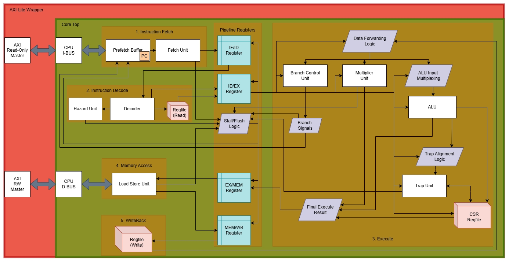

# Aether-RV64IM
**A High-Performance 5-Stage Pipelined RISC-V Core**


Aether-RV64IM is a synthesizable 64-bit RISC-V processor core written in SystemVerilog. It has a classic 5-stage in-order pipeline. It features full data forwarding for structural hazard resolution and a dual-port AXI4-Lite interface for seamless SoC integration. The core is rigorously verified using a **Synchronous Co-Simulation** strategy against the Berkeley Spike Golden Model and through **Official RISC-V ISA test suite**.

## 🏗 Microarchitecture



* **Pipeline:** 5-Stage (IF, ID, EX, MEM, WB).
* **ISA Support:** RV64I (64 Bit Base Integer) + M (Hardware Multiply/Divide).
* **Hazard Management:** 
    * **Data Forwarding:** `MEM -> EX` and `WB -> EX` bypass paths to minimize stalls.
  * **Interlocking:** Automatic hardware stall/flush logic for Load-Use hazards and branch mispredictions.
* **Bus Interface:** Independent Instruction and Data AXI4-Lite Managers (Harvard Architecture).
* **Reset Vector:** `0x80000000`.

---

## 📂 Project Structure
```text
├── dv/                # Design Verification
│   ├── tb/            # Verilator C++ Testbench (sim_main.cpp)
│   └── tests/         # Unit tests and Spike comparison Python scripts
│       ├── bin/       # Integrated official RISC-V ISA test suite
│       ├── env/       # Header File for official RISC-V ISA test suite
│       ├── scripts/   # Regression and Spike comparison Python scripts
│       └── src/       # C language tests + RV64I & RV64M tests
├── images/            # Architecture diagrams and waveforms
├── rtl/               # Synthesizable SystemVerilog Source
│   ├── core/          # CPU Core Logic
│   ├── include/       # Global Packages & Parameter Definitions
│   └── soc_testing/   # AXI RAM & SoC Wrappers for simulation
├── sw/                # Linker scripts and boot code (crt0.s)
├── Dockerfile         # Portable toolchain environment
└── Makefile           # Automated build and test targets

```

---

## ⚖️ Verification Strategy

This core uses a dual-layered verification approach to ensure 100% architectural compliance:

### 1. Regression Suite

A comprehensive suite of 74 architectural tests (integrating the official `riscv-tests for I & M extensions`) is executed via Verilator.

### 2. Spike Co-Simulation

For deep architectural validation, the core is compared line-by-line against **Spike** (the official RISC-V ISA simulator).

* **Tracer:** A hardware monitor captures every retired instruction.
* **Synchronization:** A custom Python script synchronizes the RTL trace with the Spike trace, filtering out pipeline artifacts to ensure Program Counters and Register file updates match flawlessly.

---

## Quick Start (Docker)

The easiest way to simulate the core without installing EDA tools locally is via Docker.

**1. Clone the repository (with submodules):**

```bash
git clone --recursive [https://github.com/hardly-alive/rv64.git](https://github.com/hardly-alive/rv64.git)
cd YOUR_REPO

```

**2. Build the environment:**

```bash
docker build -t riscv-lab .

```

**3. Run Verification:**

```bash
# Run the full 74-test regression
docker run --rm -v $(pwd):/work riscv-lab make regression

# Run a specific Spike Co-Simulation
docker run --rm -v $(pwd):/work riscv-lab make spike TEST=alu_test

```

---

## Prerequisites (Local Install)

If running without Docker, ensure the following are in your `$PATH`:

* **Verilator:** `v5.002+`
* **RISC-V GNU Toolchain:** `riscv64-unknown-elf-gcc`
* **Spike:** `riscv-isa-sim`
* **Python:** `3.8+`

---

## License

This project is licensed under the MIT License - see the [LICENSE](./LICENSE) file for details.